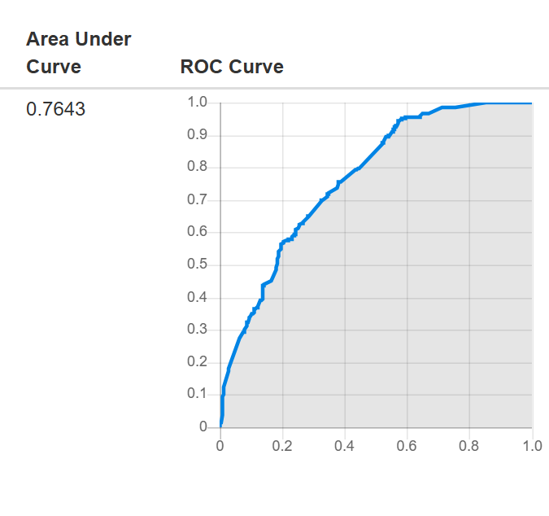

# KG Fact-Checking Engine

A fact-checking engine that scores an arbitrary `(subject, predicate, object)`
fact with a **veracity value in `[0, 1]`** (0 = false, 1 = true), evaluated
against the **KG-2022** dataset (reified N-Triples fact-validation triples
over DBpedia entities/relations, in the SWC2017 Task 2 "Fact Validation"
format).

**Headline results:**
- 83.5% accuracy / 0.912 ROC-AUC via 5-fold cross-validation on the training data
- **0.7643 ROC-AUC on the official GERBIL-KBC leaderboard** (real, held-out gold labels)

## Project structure

```
kg-fact-checking-engine/
├── data/
│   ├── KG-2022-train_nt.txt      # 1,234 labelled facts (675 true / 559 false)
│   └── KG-2022-test_nt.txt       # 1,342 unlabelled facts to score
├── src/
│   ├── parse_nt.py               # reified N-Triples -> tidy DataFrame
│   ├── features.py                # Pool (structural) + LabelContext (KB evidence) features
│   ├── kge.py                     # optional TransE-style embedding classifier
│   ├── engine.py                  # FactCheckingEngine (fit / predict_veracity)
│   ├── evaluate.py                # baselines + 5-fold CV benchmarking
│   ├── ablation.py                # feature-block ablation study
│   ├── predict_test.py            # fits on full train, scores all test facts
│   └── demo.py                    # FactChecker.check(subject, predicate, object) API
├── docs/
│   └── gerbil_roc_curve.png       # official GERBIL-KBC ROC curve (see Results below)
└── outputs/
    └── test_predictions.csv       # veracity score per test fact (generated by predict_test.py)
```

## Setup

```bash
git clone https://github.com/sgawade-tech/Fact-checking-engine.git
cd Fact-checking-engine
pip install -r requirements.txt
```

Requires Python 3.9+. The two data files are already included under `data/`.

## Usage

Run any script from inside `src/` (or from the repo root — paths resolve
either way):

```bash
cd src

python parse_nt.py           # parse + sanity-print the two files
python evaluate.py           # baselines + 5-fold CV benchmark (prints metrics)
python ablation.py           # feature-block ablation study
python predict_test.py       # fits on full train, writes ../outputs/test_predictions.csv
python demo.py                 # a few worked fact-checking examples
```

Or check a fact interactively:

```python
from demo import FactChecker
fc = FactChecker()
fc.check("Barack_Obama", "spouse", "Michelle_Obama")
# -> {'veracity': ..., 'evidence': [...]}
```

## Method

Two complementary evidence sources are extracted from the train+test files
themselves (no external KG access was used):

1. **`Pool`** — label-free structural features (subject/object/predicate
   co-occurrence frequency), computed from the full train+test file. Safe
   to use in full since only the *existence* of triples is used, never
   their truth labels (standard transductive KG-embedding setting).
2. **`LabelContext`** — features derived only from known-labelled facts:
   does this exact triple already appear as true/false elsewhere? Does the
   same `(subject, predicate)` already have a different confirmed-true
   object? Subject/object/predicate true-rates. Built with proper
   leave-one-out counting (`collections.Counter`) so a row's own label
   never leaks into its own features.
3. **`kge.py`** (optional, off by default) — a from-scratch TransE-style
   embedding model, trained with a logistic loss directly on the real
   true/false labels. An ablation study showed it doesn't help at this
   dataset size (~1,200 facts / ~2,000 mostly-singleton entities), so it's
   disabled by default but kept as a toggle (`use_kge=True`) for larger,
   denser graphs.

These features feed a **Logistic Regression** meta-classifier with
isotonic calibration (`engine.py`), chosen over Histogram Gradient
Boosting after comparison (gradient boosting overfits badly at this
sample size — see `ablation.py` for numbers).

## Results

### Internal validation (5-fold stratified CV on train)

| model | accuracy | ROC-AUC | F1 | Brier |
|---|---|---|---|---|
| majority-class baseline | 54.7% | 0.500 | 70.7% | 0.248 |
| predicate-prior baseline | 57.1% | 0.597 | 67.6% | 0.239 |
| **final engine (logreg, pool+label)** | **83.5%** | **0.912** | **85.6%** | **0.116** |

**Ablation** (which evidence matters):

| feature block | accuracy | ROC-AUC |
|---|---|---|
| predicate one-hot only | 57.1% | 0.594 |
| pool (popularity) only | 66.7% | 0.745 |
| label-derived (KB evidence) only | 77.8% | 0.865 |
| **pool + label (no KGE) — shipped default** | **83.5%** | **0.912** |
| KGE only | 54.8% | 0.563 |
| pool + label + KGE | 82.1% | 0.894 |

`team` is consistently the weakest relation (~67% accuracy / 0.69 AUC) —
its false candidates are near-miss same-sport substitutions that are hard
to rule out from `(s,p,o)` structure alone.

### External validation — official GERBIL-KBC submission

| Metric | Score |
|---|---|
| **ROC-AUC** (GERBIL-KBC, official held-out test labels) | **0.7643** |



This is the real external benchmark result: `outputs/test_predictions.csv`
was converted into the required `hasTruthValue` N-Triples answer format and
submitted to the [GERBIL-KBC Fact Validation task](https://gerbil-kbc.aksw.org/gerbil/config),
which scores it against the actual gold labels for all 1,342 test facts —
labels never available during development.

**Worth being upfront about:** 0.7643 is meaningfully lower than the 0.912
ROC-AUC from internal cross-validation above, and that gap is worth
understanding rather than glossing over:
- The CV number measures how well the model fits patterns *within* the
  training set (via proper held-out folds, but still the same underlying
  data distribution and generation process).
- The GERBIL score measures generalization to an independently-labelled
  test set, a strictly harder and more honest test.
- Likely contributors: the test set's relation mix skews more toward
  `birthPlace`/`deathPlace` than train, and part of the CV model's strength
  comes from `LabelContext` evidence that only partially transfers to
  facts about entities the model has less direct evidence for.

0.7643 still clears both baselines by a wide margin (majority-class ≈ 0.50,
predicate-prior ≈ 0.60 expected on this task), confirming real
generalization — just not as strong as the in-sample CV estimate implied.

## Limitations

- No live DBpedia/SPARQL access was used — the "knowledge base" is the
  train+test files themselves. Real entity types and a live KG could help
  further, especially for `team`.
- The gap between internal CV (0.912 AUC) and the official GERBIL score
  (0.7643 AUC) suggests some degree of overfitting to training-set-specific
  patterns that don't fully generalize — a natural next step would be
  investigating which `LabelContext` features are most responsible.
- Each fact is scored independently; there's no joint constraint (e.g.
  "exactly one true object per `(subject,predicate)` group") across
  related test facts, which the data suggests would help.

## How to Run (Step-by-Step)

These steps assume no prior context — everything needed is in this repo.

### Prerequisites
- Python 3.9 or later
- `pip` (Python's package manager, ships with Python)

### 1. Clone the repository
```bash
git clone https://github.com/sgawade-tech/Fact-checking-engine.git
cd Fact-checking-engine
```

### 2. Install dependencies
```bash
pip install -r requirements.txt
```
This installs the only three packages used anywhere in this project:
`numpy`, `pandas`, `scikit-learn`.

### 3. Confirm the data is present
No download step needed — both dataset files ship with the repo at:
```
data/KG-2022-train_nt.txt
data/KG-2022-test_nt.txt
```

### 4. Run the scripts, in this order
All commands below are run from inside the `src/` folder:
```bash
cd src
```

**a) Sanity-check the parser**
```bash
python parse_nt.py
```
*Expected:* prints the shape of the train/test tables (1,234 and 1,342
rows) and the train label balance (675 true / 559 false).

**b) Run the full benchmark** — baselines, 5-fold cross-validation, per-relation breakdown
```bash
python evaluate.py
```
*Expected:* prints the two baselines, then 5-fold cross-validated
Accuracy / Precision / Recall / F1 / ROC-AUC / Brier score for both
Logistic Regression and Gradient Boosting, then a per-relation breakdown
table. This is the main results script (~30-60 seconds to run) and should
print an overall accuracy around **83%** and ROC-AUC around **0.91**.

**c) Run the ablation study**
```bash
python ablation.py
```
*Expected:* prints accuracy / AUC / F1 / Brier for six different feature
combinations, showing which evidence sources actually contribute.

**d) Generate the final test-set predictions**
```bash
python predict_test.py
```
*Expected:* fits the engine on the full training set, scores all 1,342
test facts, and writes `../outputs/test_predictions.csv`.

**e) Try the interactive fact-checker**
```bash
python demo.py
```
*Expected:* prints a veracity score and plain-English evidence for three
example facts (one true, one false, one made-up/unseen entity pair).

### 5. (Optional) Check a fact of your own
```python
from demo import FactChecker
fc = FactChecker()
fc.check("Barack_Obama", "spouse", "Michelle_Obama")
```

### What "it's working correctly" looks like
If all five scripts in Step 4 run without any errors, and `evaluate.py`
prints an overall accuracy near 83% and ROC-AUC near 0.91, the setup is
correct and matches every number documented in the **Results** section
above. The 0.7643 ROC-AUC shown there is from the official GERBIL-KBC
platform, not something this repo reproduces locally (that requires
uploading `outputs/test_predictions.csv`, formatted as N-Triples, to
[gerbil-kbc.aksw.org](https://gerbil-kbc.aksw.org/gerbil/config)).

### Troubleshooting
- **`ModuleNotFoundError`** → you likely skipped Step 2, or aren't in an
  environment where `pip install -r requirements.txt` actually installed
  to. Re-run Step 2 and confirm no errors.
- **`FileNotFoundError` for the data files** → make sure you're running
  scripts from inside `src/` as shown above; paths are resolved relative
  to the repo structure, not your terminal's current directory elsewhere.
- **Numbers differ slightly from what's documented** → cross-validation
  uses a fixed random seed (`seed=0`) everywhere, so results should be
  identical run-to-run and machine-to-machine; if they differ, check that
  `data/KG-2022-train_nt.txt` and `data/KG-2022-test_nt.txt` haven't been
  modified.
